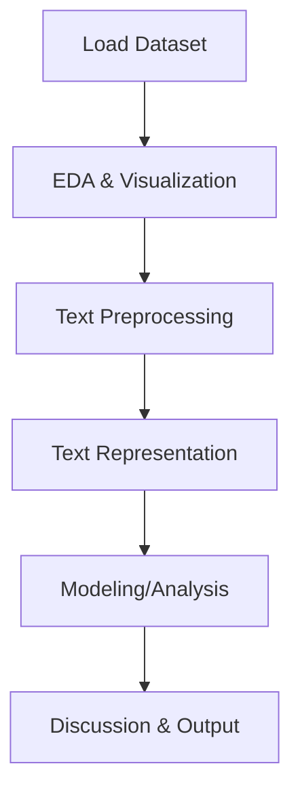

# Deep Learning Forum 07: Text Classification & Preprocessing

 

**Student Name:** Yanlis Alim Sang Putra Lase  
**Student ID:** 2702751284  
**Program:** Master's in Informatics, BINUS Graduate Program

---

## 📑 Table of Contents

1. [Project Overview](#project-overview)
2. [Pipeline Diagram](#pipeline-diagram)
3. [Dataset & Data Example](#dataset--data-example)
4. [Installation & Usage](#installation--usage)
5. [Troubleshooting](#troubleshooting)
6. [Output & Artifacts](#output--artifacts)
7. [Technical Stack](#technical-stack)
8. [Discussion & Forum Answer](#discussion--forum-answer)
9. [Repository Structure](#repository-structure)
10. [License & Contact](#license--contact)

---

## Project Overview

End-to-end pipeline for text classification using a CSV dataset (`dataset/train_data.csv`) with `text` and `label` columns. The workflow covers:

- Data acquisition (optional scraping, e.g., Playstore)
- Exploratory Data Analysis (EDA) with modern HTML report
- Text preprocessing: case folding, cleaning, tokenization, stopword removal, stemming/lemmatization
- Text representation: one-hot, TF-IDF, Word2Vec, GloVe, FastText
- Discussion and documentation of challenges and solutions

---

## Pipeline Diagram



---

## Dataset & Data Example

- **Main dataset:** `dataset/train_data.csv` (columns: `text`, `label`)
- **Optional:** Playstore review scraping (output in `output_data/`)

**Contoh isi train_data.csv:**

| text                        | label |
|-----------------------------|-------|
| "Aplikasi ini sangat bagus" |   1   |
| "Kurang memuaskan"          |   0   |

Jumlah data: cek dengan `df.shape` di notebook. Label bisa berupa 0/1 atau kategori lain sesuai kasus.

---

## Installation & Usage

Jalankan perintah berikut di PowerShell dari direktori kerja Anda.

### 1. Git Clone
```powershell
git clone https://github.com/yanlis-lase-SSG7/2521-deepLearning-forum07.git
cd 2521-deepLearning-forum07
```

### 2. Create Virtual Environment
```powershell
python -m venv venv
```

### 3. Activate Virtual Environment (Windows)
```powershell
.\venv\Scripts\activate
```

### 4. Install Dependencies
```powershell
pip install -r Forum07-requirements.txt
```

### 5. (Optional) Scrape Playstore Reviews
Jalankan cell scraping di notebook. Output akan tersimpan di `output_data/`.

### 6. Run the Main Notebook
Buka dan jalankan:
- `Forum07-text_classification_question.ipynb`
Jalankan notebook secara berurutan dari atas ke bawah untuk hasil yang konsisten.

### 7. Refresh EDA HTML Report
Jalankan cell EDA di notebook, atau jalankan ulang notebook dari awal untuk memperbarui [EDA_Report_Text.html](EDA_Report_Text.html).

---

## Troubleshooting

- **ydata-profiling error:**
	- Pastikan sudah install `ydata-profiling` (`pip install ydata-profiling`).
	- Jika error pada import, restart kernel/Jupyter.
- **spacy model error:**
	- Jalankan: `python -m spacy download en_core_web_sm`
- **gensim error:**
	- Pastikan sudah install `gensim` dan `gensim.downloader`.
- **General:**
	- Jika installasi gagal, cek koneksi internet dan gunakan `pip install --upgrade pip`.

---

## Output & Artifacts

- **Notebook utama:** text classification & preprocessing pipeline
- **EDA HTML report:** [EDA_Report_Text.html](EDA_Report_Text.html) (auto-generated, modern, bisa dibuka di browser)
- **Output scraping:** file CSV di `output_data/` (jika scraping dijalankan)
- **Visualisasi:** sebelum-sesudah preprocessing, distribusi label, dsb.

---

## Technical Stack

- Python 3.8+
- pandas, numpy
- scikit-learn
- matplotlib, seaborn
- nltk ([docs](https://www.nltk.org/))
- spacy ([docs](https://spacy.io/))
- gensim ([docs](https://radimrehurek.com/gensim/))
- ydata-profiling ([docs](https://ydata-profiling.ydata.ai/docs/master/))
- jupyter notebook / VS Code Notebook support

> **Note:** Untuk dataset besar atau training model, disarankan menggunakan runtime GPU (misal: Google Colab).

---

## Discussion & Forum Answer

Lihat bagian akhir notebook untuk:

- Kritik & saran (visualisasi, pipeline, dokumentasi)
- Kendala & solusi (setup dependency, data cleaning, efisiensi)
- Jawaban forum: Mengapa preprocessing text itu kompleks? (dengan visualisasi before/after)

---

## Repository Structure

```text
2521-deepLearning-forum07/
├── dataset/
│   └── train_data.csv
├── output_data/
│   └── com.king.candycrushsaga_reviews_games.csv (optional)
├── EDA_Report_Text.html
├── Forum07-text_classification_question.ipynb
├── Forum07-requirements.txt
├── README.md
└── ...
```

---

## License & Contact

- Lisensi: MIT (bebas digunakan untuk pembelajaran)
- Kontak: yanlis.lase@binus.ac.id | [LinkedIn](https://www.linkedin.com/in/yanlis-lase/)

---

> Semua kode dari notebook dosen (Playstore_scrapping, text_preprocessing, text_representation) sudah terintegrasi. Pipeline dapat dikembangkan untuk modeling lanjutan (misal: training, evaluasi, dsb).

